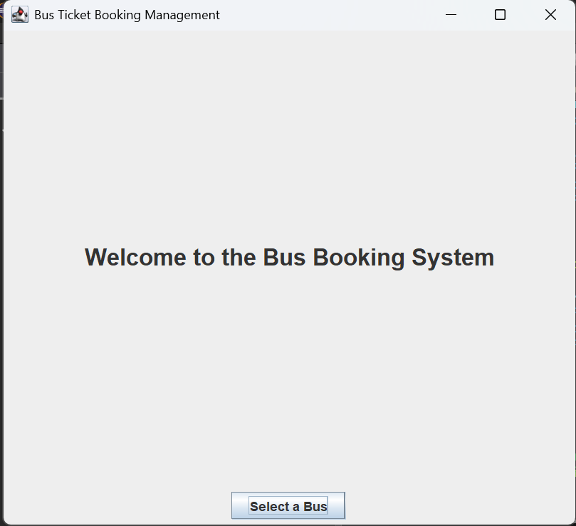
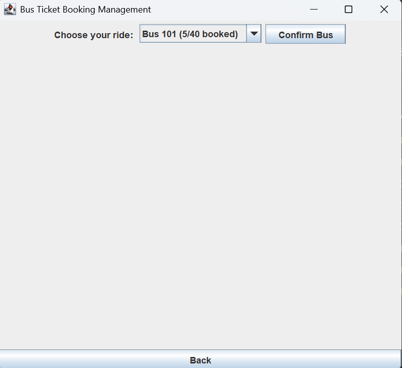

# SCD Lab Semester Project: Bus Ticket Booking Management

## Project Description
A Java Swing desktop application demonstrating core software engineering principles including Event Handling, Exception Handling, Code Refactoring, and Unit Testing. Users can book bus tickets, select destinations, validate seat numbers, and save booking records to a local file.

## Setup Instructions
1. Clone this repository to your local machine.
2. Open the project in your preferred Java IDE (IntelliJ IDEA, Eclipse, or VS Code).
3. Ensure JUnit 5 is added to your project dependencies for testing.
4. Compile the source code.
5. Run the `BookingGUI.java` file to launch the application.
6. Run `BookingManagerTest.java` to execute the automated unit tests.

## Screenshots
*(Screenshots:)*

